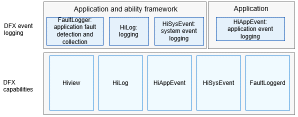

# DFX<a name="EN-US_TOPIC_0000001162014185"></a>

## Introduction<a name="section1347419114210"></a>

[Design for X](https://en.wikipedia.org/wiki/Design_for_X)  \(DFX\) refers to the software design that aims to improve the quality attribute in OpenHarmony. It mainly consists of two parts: design for reliability \(DFR\) and design for testability \(DFT\).

The DFX subsystem provides the following capabilities:

-   HiLog: Implements logging.

-   Hiview: Functions as the plug-in platform.
-   FaultLoggerd: Implements fault information collection and subscription.
-   HiAppEvent: Implements logging of application events.

## Architecture<a name="section342962219551"></a>

**Figure  1**  Architecture of the DFX subsystem<a name="fig18347131919423"></a>  




## Directory Structure<a name="section62815498425"></a>

```
base/hiviewdfx/hiviewdfx_cangjie_wrapper
├── ohos             # Cangjie DFX code
├── kit              # Cangjie kit code
├── figures          # architecture pictures
```

## Repositories Involved<a name="section767551120815"></a>

**DFX subsystem**

hiviewdfx_cangjie_wrapper

[hiviewdfx\_hiappevent](https://gitee.com/openharmony/hiviewdfx_hiappevent/blob/master/README.md)
