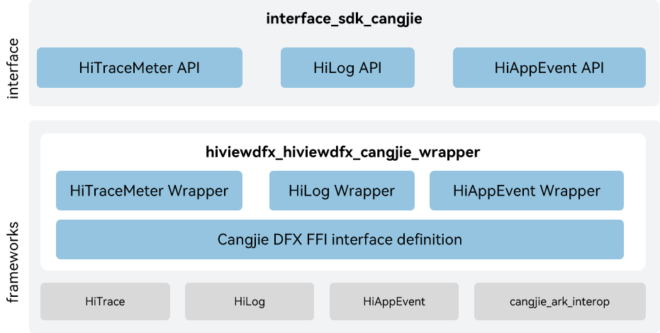

# hiviewdfx_cangjie_wrapper

## Introduction

[Design for X](https://en.wikipedia.org/wiki/Design_for_X)  \(DFX\) refers to the software design that aims to improve the quality attribute in OpenHarmony. It mainly consists of two parts: design for reliability \(DFR\) and design for testability \(DFT\).The DFX Cangjie interface currently under development only supports standard devices.

## System Architecture

**Figure  1**  Architecture of the hiviewdfx_cangjie_wrapper  



As shown in the diagram:

Interface:

- HiTraceMeter API: This module provides the ability to track process trajectories and measure program execution performance.
- HiLog API: A logging system enables applications/services to output log content according to specified levels, identifiers, and format strings, helping developers understand the running status of applications/services and better debug programs.
- HiAppEvent API: This module provides application management and event subscription capabilities, including event storage, event subscription, event cleaning, management configuration, and other functions.

Framework:

- HiTrace wrapper: Provides Implementation encapsulation of Cangjie HiTrace, providing HiTrace capabilities.
- HiLog wrapper: Provides Implementation encapsulation of Cangjie HiLog, providing HiLog capabilities.
- HiAppEvent wrapper: Provides Implementation encapsulation of Cangjie HiAppEvent, providing HiAppEvent capabilities.
- Cangjie DFX FFI interface definition: responsible for defining the C Language interoperability Cangjie interface, used to implement Cangjie DFX capabilities.
- HiTrace: Responsible for providing performance tracking capabilities, encapsulating C language interfaces for interoperation with Cangjie.
- HiLog: Responsible for providing HiLog functionality, encapsulating C language interfaces for interoperation with Cangjie.
- HiAppEvent: Responsible for providing application event tracking functionality, encapsulating C language interfaces for interoperation with Cangjie.
- cangjie_ark_interop: Responsible for providing Cangjie APILevel class definitions, which are used to annotate APIs, as well as providing the definition of BusinessException class that is thrown to users.

## Directory Structure

```
base/hiviewdfx/hiviewdfx_cangjie_wrapper
├── figures                     # architecture pictures
├── kit                         # Cangjie kit code
│   └── PerformanceAnalysisKit
├── ohos                        # Cangjie DFX code
│   ├── hi_trace_meter          # Cangjie HiTraceMeter code
│   ├── hilog                   # Cangjie HiLog code
│   └── hiviewdfx
│       └── hi_app_event        # Cangjie HiAppEvent code
└── test                        # Test cases
    ├── hiappevent              # hiappevent test cases
    ├── hilog                   # hilog test cases
    └── hitracemeter            # hitracemeter test cases
```

## Usage

As shown in the diagram, DFX Cangjie provides the following functions, and developers can comprehensively use one or more types of interfaces according to their usage requirements:

- HiLog: Implements logging.
- HiAppEvent: Implements logging of application events.
- HiTraceMeter: Implement call chain tracing throughout a service process.

DFX Cangjie related APIs, please refer to[Application Event Logging](https://gitcode.com/openharmony-sig/arkcompiler_cangjie_ark_interop/blob/master/doc/API_Reference/source_en/apis/PerformanceAnalysisKit/cj-apis-hiappevent.md), [HiLog Logging](https://gitcode.com/openharmony-sig/arkcompiler_cangjie_ark_interop/blob/master/doc/API_Reference/source_en/apis/PerformanceAnalysisKit/cj-apis-hilog.md), [Performance Tracing](https://gitcode.com/openharmony-sig/arkcompiler_cangjie_ark_interop/blob/master/doc/API_Reference/source_en/apis/PerformanceAnalysisKit/cj-apis-hi_tracemeter.md).

For relevant guidance, please refer to[Introduction to Performance Analysis Kit](https://gitcode.com/openharmony-sig/arkcompiler_cangjie_ark_interop/blob/master/doc/Dev_Guide/source_en/dfx/cj-performance-analysis-kit-overview.md).

## Constraints

Compared to ArkTS, the following features are currently not supported:

- Hiview: Functions as the plug-in platform.
- FaultLoggerd: Implements fault information collection and subscription.

## Code Contribution

Developers are welcome to contribute code, documentation, etc. For specific contribution processes and methods, please refer to [Code Contribution](https://gitcode.com/openharmony/docs/blob/master/en/contribute/code-contribution.md).

## Repositories Involved

[arkcompiler_cangjie_ark_interop](https://gitcode.com/openharmony-sig/arkcompiler_cangjie_ark_interop)

[hiviewdfx_hiappevent](https://gitcode.com/openharmony/hiviewdfx_hiappevent)

[hiviewdfx_hilog](https://gitcode.com/openharmony/hiviewdfx_hilog)

[hiviewdfx_hitrace](https://gitcode.com/openharmony/hiviewdfx_hitrace)
