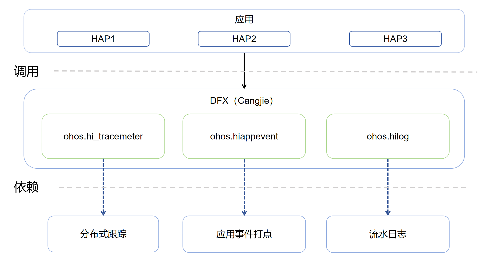

# DFX仓颉接口

## 简介

DFX仓颉接口是在OpenHarmony上基于DFX子系统能力之上封装的仓颉API。在OpenHarmony中，DFX\([Design for X](https://en.wikipedia.org/wiki/Design_for_X)\)是为了提升质量属性软件设计，目前包含的内容主要有：DFR（Design for Reliability，可靠性）和DFT（Design for Testability，可测试性）特性。当前开发的DFX仓颉接口仅支持standard设备。

## 系统架构

**图 1**  DFX仓颉架构图



如架构图所示：

- DFX仓颉接口当前提供以下能力：
    - HiLog：日志系统，使应用/服务可以按照指定级别、标识和格式字符串输出日志内容，帮助开发者了解应用/服务的运行状态，更好地调试程序。
    - HiAppEvent：本模块提供应用打点和事件订阅能力，包括事件存储、事件订阅、事件清理、打点配置等功能。
    - HiTraceMeter：本模块提供了跟踪进程轨迹，度量程序执行性能的打点能力。
- 接口封装：使用仓颉实现DFX能力。
- DFX仓颉FFI接口定义：负责定义C语言互操作仓颉接口，用于实现仓颉DFX能力。

## 目录

```
base/hiviewdfx/hiviewdfx_cangjie_wrapper
├── figures                    # 存放readme中的架构图
├── kit                        # DFX仓颉kit化代码
│   └── PerformanceAnalysisKit
├── ohos                       # DFX仓颉接口代码
│   ├── hi_trace_meter         # HiTraceMeter仓颉接口代码目录
│   ├── hilog                  # HiLog仓颉接口代码目录
│   └── hiviewdfx
│       └── hi_app_event       # HiAppEvent仓颉接口代码目录
└── test                       # 测试用例代码
```

## 使用说明

如架构图所示，DFX仓颉提供了以下功能，开发者可以根据使用诉求，综合使用一类或多类接口：

- HiLog流水日志。
- HiAppEvent应用事件记录接口及框架。
- HiTraceMeter性能打点。

DFX仓颉相关API请参见[ohos.hiviewdfx.hi_app_event（应用事件打点）](https://gitcode.com/openharmony-sig/arkcompiler_cangjie_ark_interop/blob/master/doc/API_Reference/source_zh_cn/apis/PerformanceAnalysisKit/cj-apis-hiappevent.md)，[ohos.hilog（HiLog日志打印）](https://gitcode.com/openharmony-sig/arkcompiler_cangjie_ark_interop/blob/master/doc/API_Reference/source_zh_cn/apis/PerformanceAnalysisKit/cj-apis-hilog.md)，[ohos.hi_trace.meter（性能打点）](https://gitcode.com/openharmony-sig/arkcompiler_cangjie_ark_interop/blob/master/doc/API_Reference/source_zh_cn/apis/PerformanceAnalysisKit/cj-apis-hi_tracemeter.md)。

相关指导请参见[Performance Analysis Kit简介](https://gitcode.com/openharmony-sig/arkcompiler_cangjie_ark_interop/blob/master/doc/Dev_Guide/source_zh_cn/dfx/cj-performance-analysis-kit-overview.md)。

与ArkTS相比，暂不支持以下功能：

- HiView插件平台。
- FaultLoggerd应用故障收集和订阅。

## 参与贡献

欢迎广大开发者贡献代码、文档等，具体的贡献流程和方式请参见[参与贡献](https://gitcode.com/openharmony/docs/blob/master/zh-cn/contribute/%E5%8F%82%E4%B8%8E%E8%B4%A1%E7%8C%AE.md)。

## 相关仓

[ark_compiler_cangjie_ark_interop](https://gitcode.com/openharmony-sig/arkcompiler_cangjie_ark_interop)

[hiviewdfx_hiappevent](https://gitcode.com/openharmony/hiviewdfx_hiappevent)

[hiviewdfx_hilog](https://gitcode.com/openharmony/hiviewdfx_hilog)

[hiviewdfx_hitrace](https://gitcode.com/openharmony/hiviewdfx_hitrace)
