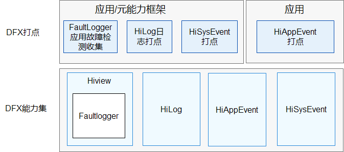

# DFX子系统<a name="ZH-CN_TOPIC_0000001162014185"></a>

## 简介<a name="section1347419114210"></a>

在OpenHarmony中，DFX\([Design for X](https://en.wikipedia.org/wiki/Design_for_X)\)是为了提升质量属性软件设计，目前包含的内容主要有：DFR（Design for Reliability，可靠性）和DFT（Design for Testability，可测试性）特性。

提供以下功能：

-   HiLog流水日志。

-   HiView插件平台。
-   FaultLoggerd应用故障收集和订阅。
-   HiAppEvent应用事件记录接口及框架。

## 系统架构<a name="section342962219551"></a>

**图 1**  子系统架构图<a name="fig18347131919423"></a>  




## 目录<a name="section62815498425"></a>

```
base/hiviewdfx/hiviewdfx_cangjie_api
├── ohos             # 仓颉DFX子系统接口实现
├── kit              # 仓颉kit化代码
├── figures          # 存放readme中的架构图
```

## 相关仓<a name="section767551120815"></a>

**DFX子系统**

hiviewdfx_cangjie_api

[hiviewdfx\_hiappevent](https://gitee.com/openharmony/hiviewdfx_hiappevent/blob/master/README.md)
